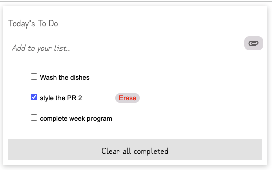

# To Do List app

> This is a minimalist to do list app, where you can add task, erase them, and drag and drop in the order you prefer.

## Built With

- HTML
- CSS
- JavaScript

## Live Demo

[Live Demo Link](https://livedemo.com)

## Getting Started

**This is an example of how you may give instructions on setting up your project locally.**
**Modify this file to match your project, remove sections that don't apply. For example: delete the testing section if the currect project doesn't require testing.**

To get a local copy up and running follow these simple example steps.

### Prerequisites
- Node

### Setup
- npm install
- clone the repository
- npm install webpack webpack-cli --save-dev

### Deployment
-npm run build

## Authors

👤 **Jasem Valencia**

- GitHub: [@JasemValencia](https://github.com/JasemDuncan)
- Twitter: [@JasemValencia](https://twitter.com/JasemValencia)
- LinkedIn: [JasemValencia](https://www.linkedin.com/in/jasem-duncan-valencia/

## 🤝 Contributing

Contributions, issues, and feature requests are welcome!

Feel free to check the [issues page](../../issues/).

## Show your support

Give a ⭐️ if you like this project!

## Acknowledgments

- Hat tip to anyone whose code was used
- Inspiration
- etc

## 📝 License

This project is [MIT](./MIT.md) licensed.
